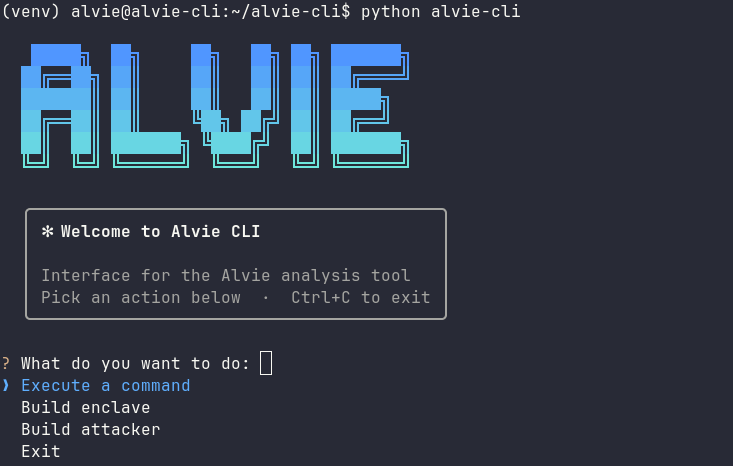
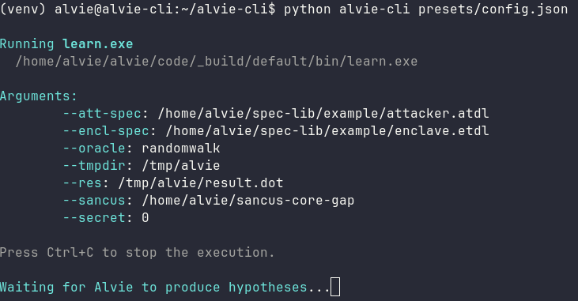

# ALVIE-CLI

---

Python wrapper for [ALVIE](https://github.com/unive-alvie/alvie)

---

### What is ALVIE?

ALVIE is a research tool for the automated security analysis and vulnerability discovery in the Sancus embedded processor, created by the University of Venice.

### Why ALVIE-CLI?

It provides a user-friendly command-line interface (CLI) that simplifies the interaction with ALVIE, by offering interactive guided workflows, configuration management and output parsing.

#### Before

```bash
$ /path/to/alvie/code/_build/default/bin/learn.exe \
  --att-spec /path/to/attacker.atdl \
  --encl-spec /path/to/enclave.etdl \
  --oracle randomwalk \
  --tmpdir /tmp/alvie \
  --res /tmp/alvie/result.dot \
  --sancus /path/to/sancus \
  --secret 0
```

### After

#### Interactive mode



#### Non-interactive mode




### Requirements

*ALVIE-CLI* is fully containerized and supports both **x86_64 (amd64)** and **aarch64 (arm64)** architectures.

Ensure you have the following installed on your system:

- **Docker**

### Installation

```bash
git clone https://github.com/Chett0/alvie-cli
make
```

<br>

If you want to update the base image `matteobusi/alvie`

```bash
make pull
make
```

### Usage

#### Interactive mode

The default mode guides you through selecting a command, providing its arguments and (optionally) saving the resulting configuration.

```bash
$ python alvie-cli
```

```bash
   █████╗  ██╗     ██╗   ██╗ ██╗ ███████╗
  ██╔══██╗ ██║     ██║   ██║ ██║ ██╔════╝
  ███████║ ██║     ██║   ██║ ██║ █████╗  
  ██╔══██║ ██║     ╚██╗ ██╔╝ ██║ ██╔══╝  
  ██║  ██║ ███████╗ ╚████╔╝  ██║ ███████╗
  ╚═╝  ╚═╝ ╚══════╝  ╚═══╝   ╚═╝ ╚══════╝

  ╭─────────────────────────────────────────╮
  │ ✻ Welcome to Alvie CLI                  │
  │                                         │
  │ Interface for the Alvie analysis tool   │
  │ Pick an action below  ·  Ctrl+C to exit │
  ╰─────────────────────────────────────────╯

? What do you want to do: 
❯ Execute a command
  Build enclave
  Build attacker
  Exit
```

<br>

You can run one of the following commands:

- **Learn**: learn a Mealy machine model
- **Flow-analysis**: Find flow-analysis (NI) violations between two models
- **Execute**: Runs the given raw input on the specified version of Sancus with the given SUL configuration
- **Property-based testing**: Random NI tests on the Sancus simulator without learning a model. Faster than Learn

<br>

```bash
? What do you want to do: Execute a command
? Do you want to use a configuration? No
? Select a command to execute: Learn
? Path to attacker specification (.atdl file) (required): /home/alvie/spec-lib/example/attacker.atdl
? Path to enclave specification (.etdl file) (required): /home/alvie/spec-lib/example/enclave.etdl
? Oracle that must be used for equivalence check (required): randomwalk
? Temporary directory where intermediate results/files will be stored (required): /tmp/alvie
? File where the final learned model will be stored (.dot file) (required): /tmp/alvie/result.dot
? Directory where the sancus-core-gap repository was cloned (required): /home/alvie/sancus-core-gap
? Do you want to provide optional arguments? Provide a secret value. Required if the enclave specification contains a secret variable '?'.
? Provide a secret value. Required if the enclave specification contains a secret variable '?'. (optional): 0
? Do you want to provide optional arguments? [✓] Done
? Do you want to save this configuration? Yes
? Select the path where to save the configuration: /home/alvie/alvie-cli/presets/config.json
? File 'config.json' already exists. Overwrite? Yes
Configuration saved to /home/alvie/alvie-cli/presets/config.json
? Do you want to see the standard raw output of the command? Yes

Running learn.exe
  /home/alvie/alvie/code/_build/default/bin/learn.exe

Arguments:
	--att-spec: /home/alvie/spec-lib/example/attacker.atdl
	--encl-spec: /home/alvie/spec-lib/example/enclave.etdl
	--oracle: randomwalk
	--tmpdir: /tmp/alvie
	--res: /tmp/alvie/result.dot
	--sancus: /home/alvie/sancus-core-gap
	--secret: 0

Press Ctrl+C to stop the execution.

Streaming raw output
```

<br>

For comprehensive usage instructions, please refer to the [ALVIE Executables Reference](https://github.com/unive-alvie/alvie/blob/documentation/docs/executables-reference.md).

<br>

You can also build the **attacker** and **enclave** specifications

```bash
? What do you want to do: Build enclave
Victim enclave builder

? Build enclave body sequence ;
? Choose instruction: mov
Examples:
  - mov r1, r2
  - mov #5, r1
  - mov @r1, r2
  - mov #42, &data_s

? Parameter 1: #5
? Parameter 2: r2
? Build enclave body [✓] Done
? Save generated entity? Yes
? Output file: /home/alvie/alvie-cli/enclaves/victim.etdl
? File 'victim.etdl' already exists. Overwrite? Yes

Generated entity:

enclave {
  mov #5, r2
};

Saved in: /home/alvie/alvie-cli/enclaves/victim.etdl
```

<br>

For a complete list of available instructions and combinators, please refer to the [ALVIE Spec Tutorial: Attacker and Victim Modeling](https://github.com/unive-alvie/alvie/blob/documentation/docs/spec-tutorial.md)


#### Non-interactive execution

When a configuration file is passed as an argument, the CLI skips the interactive
mode and executes the corresponding command directly. This is useful for scripting
or for re-running a previously saved configuration.

```bash
python alvie-cli <config-file> [-r | --raw-output]
```

- `<config-file>`: path to a saved command configuration (JSON).
- `-r`, `--raw-output`: stream the raw standard output instead of the parsed/formatted output.

The configuration file uses the same format produced by the interactive mode when
saving a command. It contains the command `name`, its `executable` and the list of
`args` (flags followed by their values):

```json
{
  "name": "Learn",
  "executable": "learn.exe",
  "args": [
    "--att-spec", "/home/alvie/spec-lib/example/attacker.atdl",
    "--encl-spec", "/home/alvie/spec-lib/example/enclave.etdl",
    "--oracle", "randomwalk",
    "--debug"
  ]
}
```

Assuming the file above is saved as `presets/config.json`, run it with:

```bash
python alvie-cli presets/config.json -r
```
