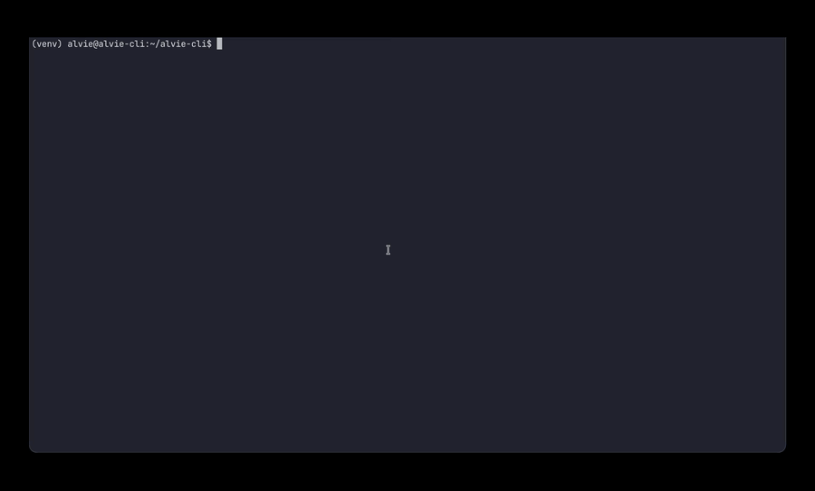
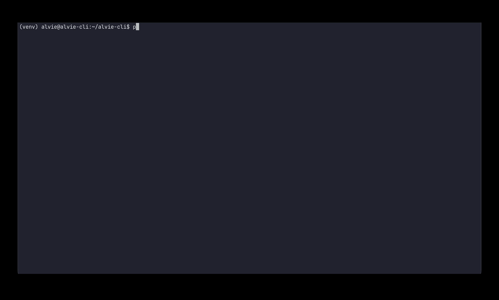

# ALVIE-UI

User interface for [ALVIE](https://github.com/unive-alvie/alvie)

<br>

### What is ALVIE?

ALVIE is a research tool for the automated security analysis and vulnerability discovery in the Sancus embedded processor, created by the University of Venice.

### Why ALVIE-UI?

It provides a user-friendly interface (CLI and web) that simplifies the interaction with ALVIE, by offering interactive guided workflows, configuration management and output parsing.

<br>

#### Before

```bash
$ /path/to/alvie/code/_build/default/bin/learn.exe \
  --att-spec /path/to/attacker.atdl \
  --encl-spec /path/to/enclave.etdl \
  --oracle randomwalk \
  --tmpdir /tmp/alvie \
  --res /tmp/alvie/result.dot \
  --sancus /path/to/sancus \
  --secret 0
```

<br>

### After

#### Interactive mode



<br>

#### Non-interactive mode

Use a previously saved configuration to run the same command without any user interaction



<br>

### Requirements

*ALVIE-UI* is fully containerized and supports both **x86_64 (amd64)** and **aarch64 (arm64)** architectures.

Ensure you have the following installed on your system:

- **Docker**

### Installation

```bash
git clone https://github.com/Chett0/alvie-cli
```

```bash
make run # start viewer in background and CLI in foreground
```
This will build ALVIE-CLI, ALVIE-VIEWER and ALVIE-BACKEND images. The viewer is available at `localhost:4242`

Other useful commands are:

```bash
# build
make cli 
make viewer 
make backend 

# stop
make stop 
make stop-cli 
make stop-viewer
make stop-backend

#restart
make restart 
make restart-cli 
make restart-viewer # restart viewer only
```

<br>

If you want to update the base image `matteobusi/alvie`

```bash
make pull
make
```

### Usage

#### Interactive mode

The default mode guides you through selecting a command, providing its arguments and (optionally) saving the resulting configuration.

<br>

You can run one of the following commands:

- **Learn**: learn a Mealy machine model
- **Flow-analysis**: Find flow-analysis (NI) violations between two models
- **Execute**: Runs the given raw input on the specified version of Sancus with the given SUL configuration
- **Property-based testing**: Random NI tests on the Sancus simulator without learning a model. Faster than Learn

<br>

##### Example: learning a model 

We want to run the **Learn.exe** command with the following specification:

- Enclave and Attacker specifications in `/home/alvie/spec-lib/example`
- Random walk oracle

We also want to save the configuration for reproducing the same command later and save the parsed output in a JSON file for further analysis with `alvie-viewer`.

```bash
? What do you want to do: Execute a command
? Do you want to use a configuration? No
? Select a command to execute: Learn
? Path to attacker specification (.atdl file) (required): /home/alvie/spec-lib/example/attacker.atdl
? Path to enclave specification (.etdl file) (required): /home/alvie/spec-lib/example/enclave.etdl
? Oracle that must be used for equivalence check (required): randomwalk
? Temporary directory where intermediate results/files will be stored (required): /tmp/alvie
? File where the final learned model will be stored (.dot file) (required): /tmp/alvie/result.dot
? Directory where the sancus-core-gap repository was cloned (required): /home/alvie/sancus-core-gap
? Do you want to provide optional arguments? Provide a secret value. Required if the enclave specification contains a secret variable '?'.
? Provide a secret value. Required if the enclave specification contains a secret variable '?'. (optional): 0
? Do you want to provide optional arguments? [✓] Done
? Do you want to save this configuration? Yes
? Select the path where to save the configuration: /home/alvie/alvie-cli/presets/config.json
Configuration saved to /home/alvie/alvie-cli/presets/config.json
? Do you want to see the standard raw output of the command? No
? Where do you want to save parsed output JSON? /home/alvie/alvie-cli/parsed-output/parsed_output.json

...

Parsed output saved to /home/alvie/alvie-cli/parsed-output/parsed_output.json

Alvie finished successfully.
```

<br>

For comprehensive usage instructions, please refer to the [ALVIE Executables Reference](https://github.com/unive-alvie/alvie/blob/documentation/docs/executables-reference.md).

<br>

You can also build the **attacker** and **enclave** specifications

```bash
? What do you want to do: Build enclave
Victim enclave builder

? Build enclave body sequence ;
? Choose instruction: mov
Examples:
  - mov r1, r2
  - mov #5, r1
  - mov @r1, r2
  - mov #42, &data_s

? Parameter 1: #5
? Parameter 2: r2
? Build enclave body [✓] Done
? Save generated entity? Yes
? Output file: /home/alvie/alvie-cli/enclaves/victim.etdl
? File 'victim.etdl' already exists. Overwrite? Yes

Generated entity:

enclave {
  mov #5, r2
};

Saved in: /home/alvie/alvie-cli/enclaves/victim.etdl
```

<br>

For a complete list of available instructions and combinators, please refer to the [ALVIE Spec Tutorial: Attacker and Victim Modeling](https://github.com/unive-alvie/alvie/blob/documentation/docs/spec-tutorial.md)

<br>

#### Non-interactive execution

When one or more configuration files are passed as arguments, the CLI skips the
interactive mode and executes the corresponding commands directly. This is useful
for scripting or for re-running previously saved configurations.

```bash
python alvie-cli <config-file> [<config-file> ...] [-r | --raw-output] [-o | --output <output-file>] [-p | --parsed-output <json-file> ...] [--njobs <n>] [-i | --interactive] [-n | --name <name> ...]
```

- `<config-file>`: one or more paths to saved command configurations (JSON). When
  several files are provided they are executed sequentially, unless `--njobs` is specified.
- `-r`, `--raw-output`: stream the raw standard output instead of the parsed/formatted output.
- `-o`, `--output`: path to a single file where the alvie output (the
  parsed/formatted hypotheses, or the raw output with `-r`) is written instead of
  the terminal (default: stdout).
- `-p`, `--parsed-output`: one or more paths to JSON files where the structured
  parsed output is saved, one path per configuration in the same order they are
  listed. The JSON document contains the executable, its arguments, the start/end
  timestamps, a recap of the output symbols and the parsed hypotheses.
- `--njobs <n>`: number of configurations to run in parallel (default: `1`, i.e. sequential execution).
- `-i`, `--interactive`: after running, upload each parsed output to the backend
- `-n`, `--name`: one or more names under which the parsed output is stored on the
backend, one per configuration in the same order they are listed. Requires `--interactive`

The configuration file uses the same format produced by the interactive mode when
saving a command.

```json
{
  "name": "Learn",
  "executable": "learn.exe",
  "args": [
    {
      "flag": "--att-spec",
      "value": "/home/alvie/spec-lib/example/attacker.atdl"
    },
    {
      "flag": "--encl-spec",
      "value": "/home/alvie/spec-lib/example/enclave.etdl"
    },
    {
      "flag": "--oracle",
      "value": "randomwalk"
    },
    {
      "flag": "--tmpdir",
      "value": "/tmp/alvie"
    },
    {
      "flag": "--res",
      "value": "/tmp/alvie/result.dot"
    },
    {
      "flag": "--sancus",
      "value": "/home/alvie/sancus-core-gap"
    },
    {
      "flag": "--secret",
      "value": "0"
    }
  ]
}
```

Assuming the file above is saved as `presets/config.json`, run it with:

```bash
python alvie-cli presets/config.json -r -o /path/to/output.txt -p /path/to/parsed.json
```

##### Running multiple configurations

You can pass several configuration files at once. By default they run
sequentially, in the order they are listed on the command line:

```bash
python alvie-cli presets/learn.json presets/flow-analysis.json presets/pbt.json
```

Use `--njobs` to run several configurations in parallel:

```bash
python alvie-cli presets/*.json --njobs 4
```

<br>

### ALVIE-VIEWER

Documentation at [ALVIE Viewer](./alvie-viewer)
