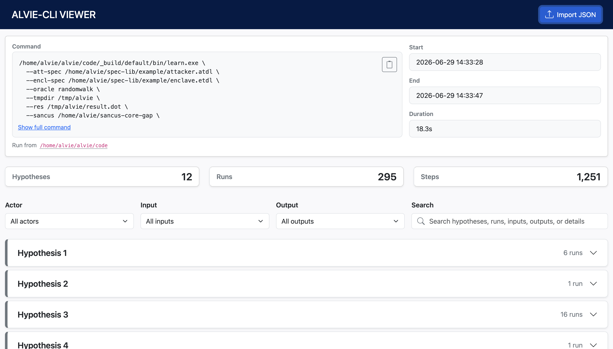
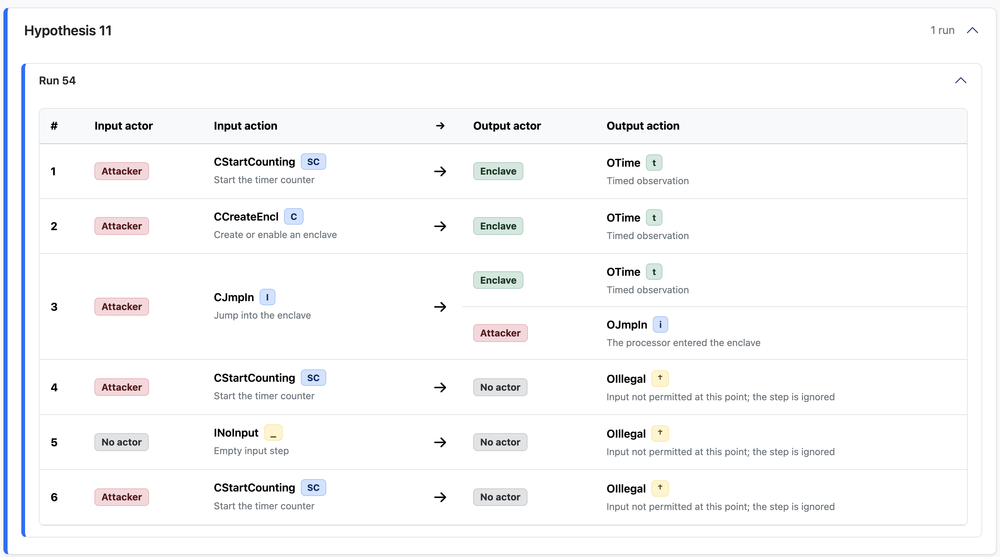

# ALVIE VIEWER

Web interface for exploring and filtering parsed JSON results produced by ALVIE-CLI.



<br>

### Dependencies

- Node 22+

<br>

### Features

- Import parsed ALVIE output through file selection, drag and drop, or URL
- Reload and share the current file through the `?file=` query parameter
- View execution recap: command run, executable, arguments, start/end timestamps
- Browse hypotheses, runs, steps
- Filter results by actor, input and output symbols
- Search results using regular expressions

<br>

### Usage

First generate a parsed output file with ALVIE-CLI

```bash
python alvie-cli presets/config.json \
  --parsed-output parsed-output/result.json
```

Then open `http://localhost:4242` and import `parsed-output/result.json`. The
viewer updates the address to:

```text
http://localhost:4242/?file=/parsed-output/result.json
```

Files inside the root `parsed-output` directory are served read-only. You can
also open an address in this format directly; the viewer loads, parses, and validates the referenced file automatically.

<br>

Each hypothesis can be expanded to show the runs and a table with all its steps. 



You can filter results by actor, input or output symbols. When a run matches the selected filters, all its steps are displayed, so you can understand the entire context.

<br>

You can also use the search bar to filter by hypothesis or run number and use regular expressions to search for multiple patterns.

#### Examples

Search for hypotheses 1-3:

```bash
hypothesis [1-3]\b
```

<br>

Search for runs 11000 - 12000:

```bash
\brun 11\d{3}\b
```

<br>

Search for multiple patterns:

```bash
<regex1>|<regex2>|<regex3>
```
